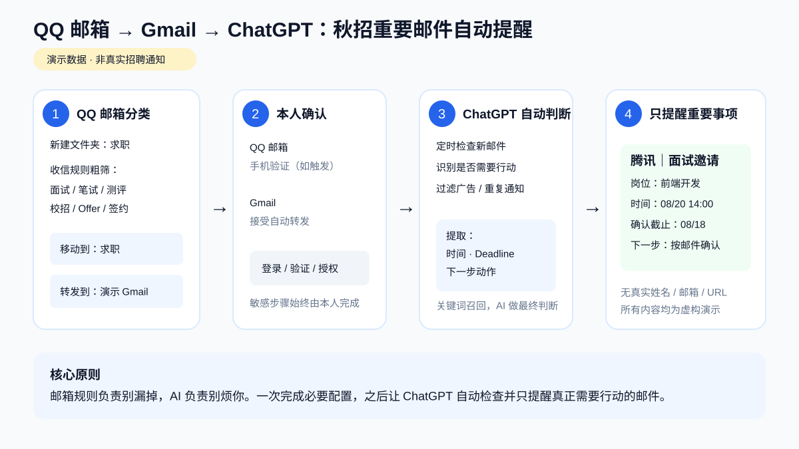

# Smart Email Notifier｜AI 重要邮件智能提醒

把不同邮箱中的重要邮件汇聚到 AI 可访问的邮箱，由 AI 判断哪些信息真正需要关注，并提取 Deadline、时间、链接和下一步行动。

> **邮箱规则负责别漏掉，AI 负责别烦你。**



## 它解决什么问题？

邮箱里真正重要的通知经常和广告、Newsletter、普通系统通知混在一起。纯关键词规则又不够可靠：重要邮件可能只写“下一轮安排”，广告邮件却可能包含“面试”“笔试”等大量关键词。

因此本项目采用两层过滤：

```text
源邮箱
  ↓
文件夹 / 收信规则（粗筛，提高召回率）
  ↓
选择性转发
  ↓
AI 可访问邮箱
  ↓
AI 语义判断（提高准确率）
  ↓
提取行动 / Deadline
  ↓
定时或条件提醒
```

## 可用场景

- **求职 / 秋招**：笔试、测评、面试、HR 通知、Offer、签约、背调
- **学校**：考试、选课、作业 Deadline、行政通知
- **账单**：付款失败、续费、账单到期
- **会议**：邀请、改期、会前准备
- **订单**：物流异常、取件期限、退款
- **账号安全**：登录告警、验证请求、需要本人操作的通知

## 快速开始

1. 明确哪些邮件是你不能错过的；
2. 在源邮箱创建专用文件夹/标签（推荐但非强制）；
3. 设置较宽松的收信规则，并选择性转发到 AI 可访问邮箱；
4. 完成邮箱服务商要求的人工验证；
5. 将目标邮箱连接到 AI；
6. 用语义规则判断邮件是否真正需要行动；
7. 按场景时效设置检查频率；
8. 用测试邮件验证完整链路。

## 真实案例：QQ 邮箱 → Gmail → ChatGPT

项目最初来自一个真实需求：秋招期间，笔试、测评和面试通知混在大量招聘邮件中，容易错过截止时间。

推荐流程：

```text
QQ 邮箱新建「求职」文件夹
→ 设置收信规则
→ 移动到「求职」+ 自动转发 Gmail
→ QQ 邮箱手机验证
→ Gmail 点击「接受转发」
→ ChatGPT 连接 Gmail
→ 创建定时检查任务
→ AI 只在真正需要操作时提醒
```

完整图文配置见：[QQ 邮箱 → Gmail → ChatGPT 配置指南](./docs/qqmail-gmail-chatgpt.md)。

求职预设见：[presets/job-search.md](./presets/job-search.md)。

## Skill

可复用的 Agent / Skill 指令见 [`SKILL.md`](./SKILL.md)。核心 Skill 保持邮箱服务商和使用场景无关，QQ 邮箱只是一个具体 adapter 示例。

## 隐私原则

不要默认转发整个私人邮箱。优先使用专用文件夹 + 选择性转发，只让 AI 处理确实需要自动化的邮件。

公开截图或教程前，务必移除完整邮箱地址、手机号、验证码、姓名/候选人 ID、私人笔试/面试链接、会议链接、token、cookie、授权码和可扫描二维码。

仓库演示统一使用 `example@qq.com`、`yourname@gmail.com`、`https://example.com/...` 等占位信息。

## English

English documentation: [README.md](./README.md)
